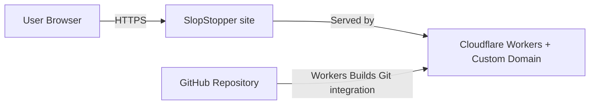
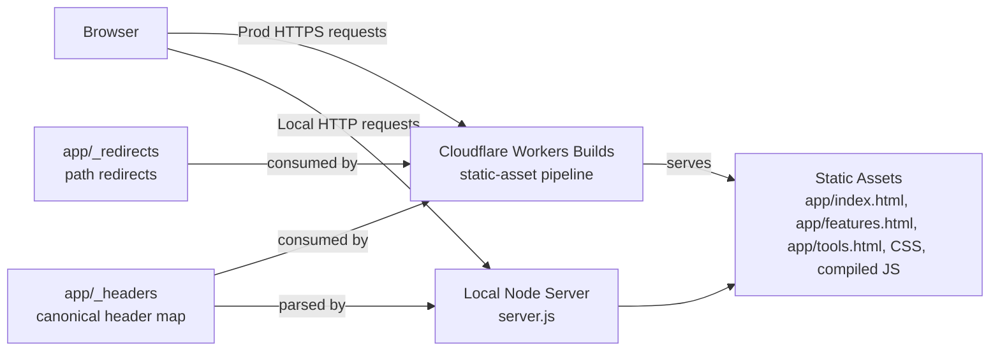
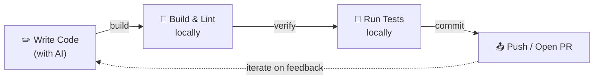
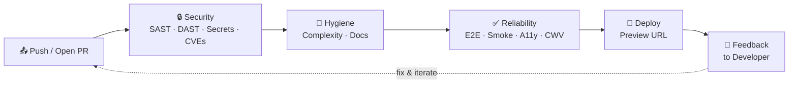

# Architecture

Architecture structure and boundaries overview for this static site
served by Cloudflare Workers Builds.

Notation: C4 (Context + Container).

## Scope

- Static HTML/CSS/JS pages served in production by Cloudflare Workers
  Builds' static-asset pipeline (no Worker code).
- Local development and DAST use `server.js`.
- Security headers live in `app/_headers` (Cloudflare native). The
  static-asset pipeline applies them in prod; `server.js` parses the
  same file for local parity; the CSP-drift gate reads it too.
- Redirects live in `app/_redirects` (Cloudflare native).

## Project Layout

```
slopstopper/
├── .github/workflows/        # All SlopStopper workflows are `ss-*.yml`
│                             #   (copilot-setup-steps.yml stays bare — platform-fixed)
├── .ss/                      # Everything SlopStopper owns lives here
│   ├── scripts/              # Python/shell analysis scripts called by tasks
│   └── reports/              # Generated report output (.gitignored)
├── app/                      # Static site — served by Cloudflare Workers Builds' asset pipeline
│   ├── index.html            # Hero + Get Started + capability grid
│   ├── features.html         # 5 category cards with YAML excerpts + mock reports
│   ├── tools.html            # 15 tool cards with YAML/config excerpts
│   ├── feedback.html         # Giscus comments embed (per-path CSP exception)
│   ├── _headers              # Canonical header map — Cloudflare native format
│   ├── _redirects            # Path redirects — Cloudflare native format
│   ├── shared.css            # Brand system, components, layout primitives
│   ├── copy.js               # Progressive-enhancement copy button; only runtime JS
│   ├── manifest.webmanifest  # PWA manifest
│   ├── robots.txt            # Allows all, points at the sitemap
│   └── sitemap.xml           # Lists indexable pages
├── docs/                     # Documentation hub — see docs/index.md
├── src/                      # TypeScript stubs (build target; runtime JS is limited to app/copy.js)
├── tests/                    # Playwright smoke + accessibility specs
├── install.sh                # Adopter installer
├── wrangler.jsonc            # Static-asset config (directory + html_handling); no Worker code
├── server.js                 # Local dev server — parses app/_headers for prod parity
├── Taskfile.yml              # Thin root with `includes: { ss: ./Taskfile.ss.yml }`
├── Taskfile.ss.yml           # SlopStopper task definitions
├── README.md                 # Consumer-facing entry point
├── AGENTS.md                 # Thin agent pointer (see docs/index.md map pattern)
└── CONTRIBUTING.md → docs/contributing/README.md
```

## C4 – Level 1 (System Context)



## C4 – Level 2 (Container)



## Request Flow (Minimal)

1. Browser requests a page.
2. In production, Cloudflare Workers Builds' static-asset pipeline
   serves the file from `app/`, applies the per-path headers from
   `app/_headers`, and honours redirects from `app/_redirects`. No
   Worker code runs.
3. In local/dev scanning, `server.js` serves the same `app/` directory
   and parses the same `app/_headers` so prod and local stay identical.

## Development Loops

SlopStopper organises quality feedback into two loops. Together they keep velocity high while keeping quality consistent.

### Inner Loop — Local

The fast, local cycle a developer (or AI agent) runs before pushing code. Completes in seconds to minutes.



### Outer Loop — CI/CD

The automated CI/CD pipeline triggered by every push or pull request. Each stage provides deterministic feedback before code reaches production.



### How the Loops Work Together

| Loop | Where | Speed | Triggered by |
|------|-------|-------|--------------|
| Inner | Local machine | Seconds – minutes | Developer action |
| Outer | GitHub Actions | Minutes | Push or PR |

When the outer loop flags an issue, the developer re-enters the inner loop to fix it. Because the outer loop is **deterministic** — the same checks run the same way every time — developers can trust its feedback and act on it quickly.
