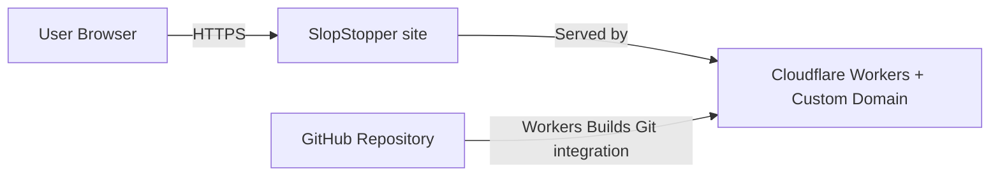
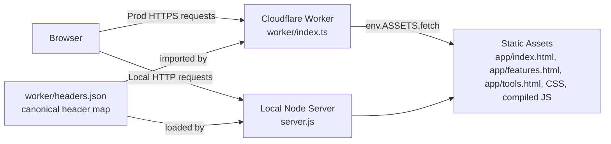
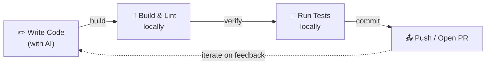
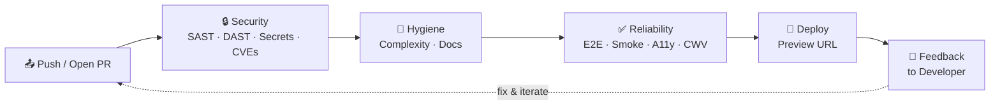

# Architecture

Architecture structure and boundaries overview for this static site
hosted on a Cloudflare Worker.

Notation: C4 (Context + Container).

## Scope

- Static HTML/CSS/JS pages served in production by a Cloudflare
  Worker with the `[assets]` binding.
- Local development and DAST use `server.js`.
- Security headers live in `worker/headers.json`. The Worker, the
  local server and the CSP-drift gate all read the same file.

## C4 – Level 1 (System Context)

## C4 – Level 2 (Container)

## Request Flow (Minimal)

1. Browser requests a page.
2. In production, the Cloudflare Worker fetches the asset via the
   `[assets]` binding, then applies the per-path headers from
   `worker/headers.json` before returning the response.
3. In local/dev scanning, `server.js` serves the same `app/` directory
   and loads the same `worker/headers.json` so prod and local stay
   identical.

## Development Loops

SlopStopper organises quality feedback into two loops. Together they keep velocity high while keeping quality consistent.

### Inner Loop — Local

The fast, local cycle a developer (or AI agent) runs before pushing code. Completes in seconds to minutes.

### Outer Loop — CI/CD

The automated CI/CD pipeline triggered by every push or pull request. Each stage provides deterministic feedback before code reaches production.

### How the Loops Work Together

| Loop | Where | Speed | Triggered by |
|------|-------|-------|--------------|
| Inner | Local machine | Seconds – minutes | Developer action |
| Outer | GitHub Actions | Minutes | Push or PR |

When the outer loop flags an issue, the developer re-enters the inner loop to fix it. Because the outer loop is **deterministic** — the same checks run the same way every time — developers can trust its feedback and act on it quickly.
