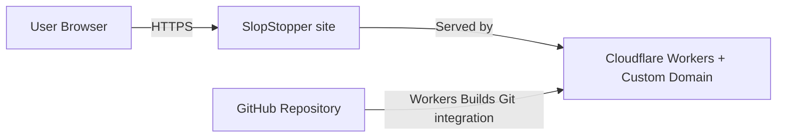
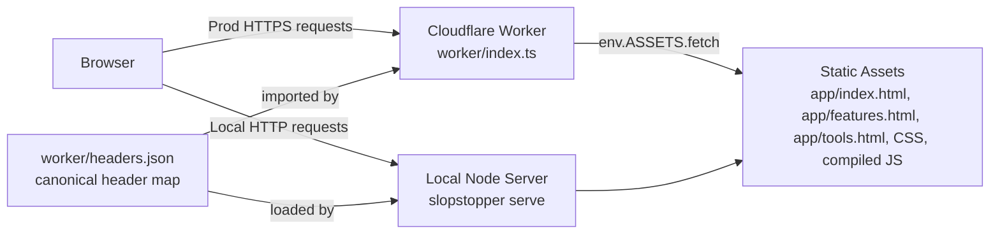
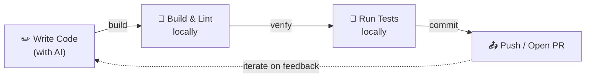
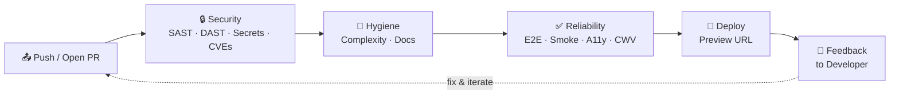

# Architecture

Architecture structure and boundaries overview for this static site
hosted on a Cloudflare Worker.

Notation: C4 (Context + Container).

## Scope

- Static HTML/CSS/JS pages served in production by a Cloudflare
  Worker with the `[assets]` binding.
- Local development and DAST use `slopstopper serve` (the bundled static server inside slopstopper-cli).
- Security headers live in `worker/headers.json`. The Worker, the
  local server and the CSP-drift gate all read the same file.

## Project Layout

```
slopstopper/
├── .github/workflows/        # All SlopStopper workflows are `ss-*.yml`
│                             #   (jdx/mise-action installs the pinned CLI + task, then `task ss:…` / `slopstopper run …`)
├── .ss/                      # SlopStopper-owned (adopter side)
│   ├── reports/              # CLI writes here (.gitignored)
│   └── .workflows-installed  # Manifest of installed workflows (commit this)
├── cli/                      # slopstopper-cli — the Python package (PyPI); pinned via mise
│   ├── slopstopper/cli.py    # argparse dispatcher + bare-invocation banner
│   ├── slopstopper/output.py # Shared formatters + `--quiet` toggle
│   ├── slopstopper/checks/   # One module per check (security/hygiene/reliability)
│   ├── slopstopper/data/     # Bundled Playwright specs, lighthouserc dev/prod, server.js
│   ├── slopstopper/templates.py / emit.py / discovery.py / config.py
│   ├── tests/                # pytest suite (486 tests)
│   └── pyproject.toml        # Beta — standalone: `pipx install slopstopper-cli`; suite: pinned in mise.toml
├── app/                      # Static site — bound as the [assets] dir on the Worker
│   ├── index.html            # Hero + Get Started (CLI quick-try + mise suite install) + capability grid
│   ├── features.html         # 5 category cards with workflow excerpts + mock reports
│   ├── tools.html            # Tool cards (incl. slopstopper-cli itself)
│   ├── feedback.html         # Giscus comments embed (per-path CSP exception)
│   ├── shared.css / copy.js / manifest.webmanifest / robots.txt / sitemap.xml
├── docs/                     # Documentation hub — see docs/index.md
├── install.sh                # Adopter installer (pins CLI via mise + seeds workflows)
├── wrangler.jsonc            # Cloudflare Worker + [assets] binding
├── worker/                   # Cloudflare Worker — applies headers to every response
│   ├── index.ts              # fetch handler: env.ASSETS.fetch + per-path headers
│   └── headers.json          # Canonical header map (CSP, COOP/COEP, X-Frame-Options …)
├── mise.toml                 # Toolchain pins — `"pipx:slopstopper-cli"` + `task` + `node` (read locally + by jdx/mise-action)
├── Taskfile.yml              # Thin root with `includes: { ss: ./Taskfile.ss.yml }`
├── Taskfile.ss.yml           # `task ss:*` shims that call `slopstopper run …`
├── README.md                 # Consumer-facing entry point
├── AGENTS.md                 # Thin agent pointer (see docs/index.md map pattern)
└── CONTRIBUTING.md → docs/contributing/README.md
```

## C4 – Level 1 (System Context)



## C4 – Level 2 (Container)



## Single-route invocation: `task ss:*`

SlopStopper exposes one canonical entry point for any check: `task ss:<category>:<name>`. Humans, agents AND CI all invoke through it, so the suite shares the same invocation surface as everything else in the codebase (`task build`, `task deploy`, `task lint`).

```
┌─────────────────────────────────────────────────────────────────┐
│  Humans / Agents / CI                                           │
│                                                                 │
│       task ss:hygiene:complexity                                │
│       task ss:reliability:smoke -- http://localhost:8080        │
│       task ss:security:scan                                     │
└────────────────────────┬────────────────────────────────────────┘
                         │   Taskfile.ss.yml shims
                         ▼
┌─────────────────────────────────────────────────────────────────┐
│  slopstopper-cli (Python, PyPI)                                 │
│                                                                 │
│       slopstopper run <category>:<name> [--url URL] [--ci]      │
└────────────────────────┬────────────────────────────────────────┘
                         │   subprocess
                         ▼
┌─────────────────────────────────────────────────────────────────┐
│  External tools (semgrep, lizard, trivy, playwright, zap, ...)  │
└─────────────────────────────────────────────────────────────────┘
```

Adopters who don't want Task in their CI pass `--no-task` to `install.sh` and get workflows that call the CLI directly — same execution path, same exit codes, same reports. The Task layer is the surface to promote; the CLI is the implementation each shim calls into.

See [`Taskfile.ss.yml`](../../Taskfile.ss.yml) for the shipped shim catalogue.

## Toolchain: mise + Task (why both)

SlopStopper deliberately uses **two** tools with non-overlapping jobs — the
idiomatic mise+Task split, not redundancy:

| Tool | Job | Where it's defined |
| ---- | --- | ------------------ |
| **mise** | *Tool versions.* Pins and installs `slopstopper-cli`, `task` itself, and `node`, then activates them **per-directory** | `mise.toml` (`[tools]` `"pipx:slopstopper-cli"` + `task` + `node`) |
| **Task** | *Commands.* The single invocation surface — `task ss:<check>` | `Taskfile.ss.yml` shims |

Why mise owns versions: a normal global install puts **one** `slopstopper` binary
on `PATH`, which can't match different repos pinned to different versions — so
local runs silently drifted off the pin (CI didn't, because it reinstalls per
run). mise keeps every version side-by-side and rewrites `PATH` per-directory, so
the active `slopstopper` **follows the repo**. The pin in `mise.toml` is the single
source of truth both local runs and CI (`jdx/mise-action`) read.

`node` rides the same mechanism: it's a tool version, so it lives in `mise.toml`
(not `.slopstopper.yml`) and CI gets it from `jdx/mise-action` — there's no
separate `setup-node` step or `SLOPSTOPPER_NODE_VERSION` repo variable.
`install.sh` seeds `node = "20"` into an adopter's `mise.toml` only when they
haven't already declared a Node version (`mise.toml` / `.node-version` / `.nvmrc`).

Why Task stays the interface: `task ss:check` sits alongside an adopter's own
`task build` / `task deploy`, so the suite shares their existing command surface
rather than introducing a parallel one. mise auto-installs `task`, so it remains a
one-install story — install mise, everything else flows from `mise.toml`.

In short: **mise installs it (pinned), Task runs it.** Moving the CLI pin is
`install.sh --upgrade-cli` / `--cli-version` (both wrap `mise use`); see
[`docs/runbooks/UPGRADE_CLI.md`](../runbooks/UPGRADE_CLI.md).

## Request Flow (Minimal)

1. Browser requests a page.
2. In production, the Cloudflare Worker fetches the asset via the
   `[assets]` binding, then applies the per-path headers from
   `worker/headers.json` before returning the response.
3. In local/dev scanning, `slopstopper serve` (bundled inside
   slopstopper-cli) serves the same `app/` directory and auto-detects
   the same `worker/headers.json` so prod and local stay identical.

## Development Loops

SlopStopper organises quality feedback into two loops. Together they keep velocity high while keeping quality consistent.

### Inner Loop — Local

The fast, local cycle a developer (or AI agent) runs before pushing code. Completes in seconds to minutes.



### Outer Loop — CI/CD

The automated CI/CD pipeline triggered by every push or pull request. Each stage provides deterministic feedback before code reaches production.



### How the Loops Work Together

| Loop | Where | Speed | Triggered by |
|------|-------|-------|--------------|
| Inner | Local machine | Seconds – minutes | Developer action |
| Outer | GitHub Actions | Minutes | Push or PR |

When the outer loop flags an issue, the developer re-enters the inner loop to fix it. Because the outer loop is **deterministic** — the same checks run the same way every time — developers can trust its feedback and act on it quickly.
