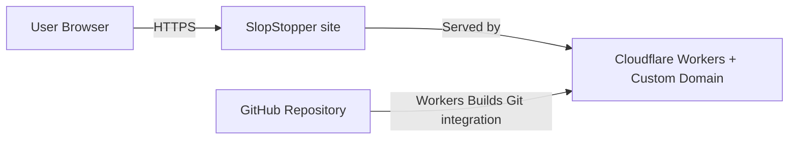
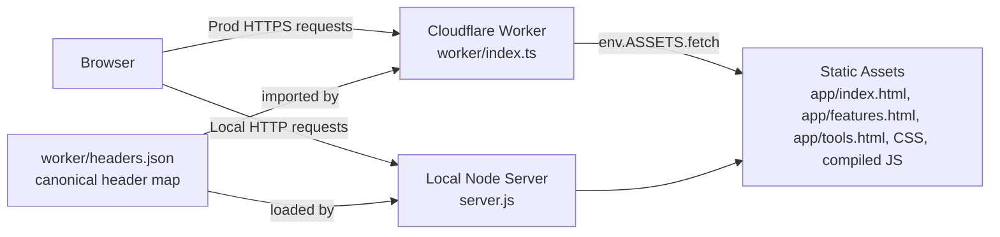
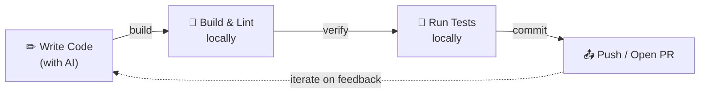
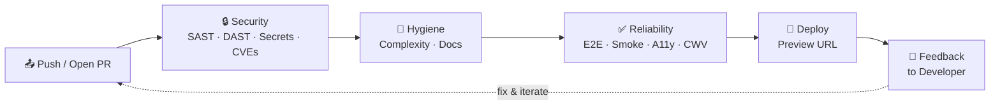

# Architecture

Architecture structure and boundaries overview for this static site
hosted on a Cloudflare Worker.

Notation: C4 (Context + Container).

## Scope

- Static HTML/CSS/JS pages served in production by a Cloudflare
  Worker with the `[assets]` binding.
- Local development and DAST use `server.js`.
- Security headers live in `worker/headers.json`. The Worker, the
  local server and the CSP-drift gate all read the same file.

## Project Layout

```
slopstopper/
├── .github/workflows/        # All SlopStopper workflows are `ss-*.yml`
│                             #   (copilot-setup-steps.yml stays bare — platform-fixed)
├── .ss/                      # Everything SlopStopper owns lives here
│   ├── scripts/              # Python/shell analysis scripts called by tasks
│   └── reports/              # Generated report output (.gitignored)
├── app/                      # Static site — bound as the [assets] dir on the Worker
│   ├── index.html            # Hero + Get Started + capability grid
│   ├── features.html         # 5 category cards with YAML excerpts + mock reports
│   ├── tools.html            # 15 tool cards with YAML/config excerpts
│   ├── feedback.html         # Giscus comments embed (per-path CSP exception)
│   ├── shared.css            # Brand system, components, layout primitives
│   ├── copy.js               # Progressive-enhancement copy button; only runtime JS
│   ├── manifest.webmanifest  # PWA manifest
│   ├── robots.txt            # Allows all, points at the sitemap
│   └── sitemap.xml           # Lists indexable pages
├── docs/                     # Documentation hub — see docs/index.md
├── src/                      # TypeScript stubs (build target; runtime JS is limited to app/copy.js)
├── tests/                    # Playwright smoke + accessibility specs
├── install.sh                # Adopter installer
├── .slopstopper.yml          # Adopter config: headers adapter, page lists, urls, node version
├── .slopstopper.yml.example  # Fully-annotated schema reference
├── wrangler.jsonc            # Cloudflare Worker + [assets] binding
├── worker/                   # Cloudflare Worker — applies headers to every response
│   ├── index.ts              # fetch handler: env.ASSETS.fetch + per-path headers
│   └── headers.json          # Canonical header map (CSP, COOP/COEP, X-Frame-Options …)
├── server.js                 # Local dev server — reads worker/headers.json for parity
├── Taskfile.yml              # Thin root with `includes: { ss: ./Taskfile.ss.yml }`
├── Taskfile.ss.yml           # SlopStopper task definitions
├── README.md                 # Consumer-facing entry point
├── AGENTS.md                 # Thin agent pointer (see docs/index.md map pattern)
└── CONTRIBUTING.md → docs/contributing/README.md
```

## Configuration (`.slopstopper.yml`)

Adopter-specific tuning lives in `.slopstopper.yml` at the repo root. `install.sh` seeds this file once and never overwrites it, so knobs survive reinstalls. Slopstopper scripts and workflows read from it instead of requiring hardcoded values or env-var plumbing in every workflow file.

| Key | Controls |
|-----|----------|
| `node_version` | Node.js version for all workflow `setup-node` steps. Set the matching GitHub repo variable to activate: `gh variable set SLOPSTOPPER_NODE_VERSION --body "$(yq '.node_version' .slopstopper.yml)"` |
| `headers.source` + `headers.format` | Path and format of the headers file the CSP-drift check reads. Shipped adapters: `json` (Cloudflare Worker `headers.json`), `cloudflare-text` (`_headers` format), `auto` (inferred from extension). Set `source: null` to skip the drift check entirely. |
| `urls.production` / `urls.preview` | Base URLs for reliability + DAST workflows |
| `pages.*` | Comma-separated page paths for each reliability check (smoke, accessibility, seo, broken_links) |
| `smoke.og_image_path` | Path to the site-wide og:image; `''` skips the assertion |
| `workflows.disabled` | Workflow filenames to exclude from this repo (persists across reinstalls) |

The fully-annotated schema is in [`.slopstopper.yml.example`](../../.slopstopper.yml.example).

## C4 – Level 1 (System Context)



## C4 – Level 2 (Container)



## Request Flow (Minimal)

1. Browser requests a page.
2. In production, the Cloudflare Worker fetches the asset via the
   `[assets]` binding, then applies the per-path headers from
   `worker/headers.json` before returning the response.
3. In local/dev scanning, `server.js` serves the same `app/` directory
   and loads the same `worker/headers.json` so prod and local stay
   identical.

## Development Loops

SlopStopper organises quality feedback into two loops. Together they keep velocity high while keeping quality consistent.

### Inner Loop — Local

The fast, local cycle a developer (or AI agent) runs before pushing code. Completes in seconds to minutes.



### Outer Loop — CI/CD

The automated CI/CD pipeline triggered by every push or pull request. Each stage provides deterministic feedback before code reaches production.



### How the Loops Work Together

| Loop | Where | Speed | Triggered by |
|------|-------|-------|--------------|
| Inner | Local machine | Seconds – minutes | Developer action |
| Outer | GitHub Actions | Minutes | Push or PR |

When the outer loop flags an issue, the developer re-enters the inner loop to fix it. Because the outer loop is **deterministic** — the same checks run the same way every time — developers can trust its feedback and act on it quickly.
