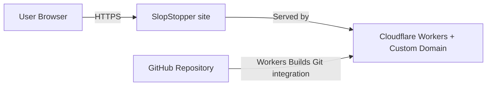
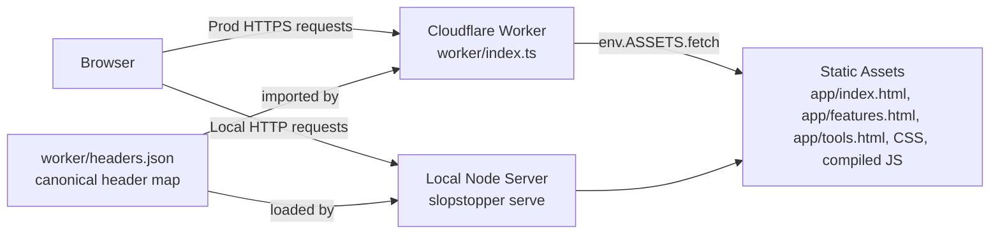
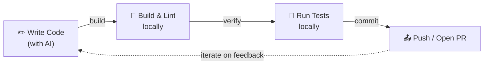
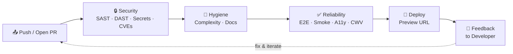

# Architecture

Architecture structure and boundaries overview for this static site
hosted on a Cloudflare Worker.

Notation: C4 (Context + Container).

## Scope

- Static HTML/CSS/JS pages served in production by a Cloudflare
  Worker with the `[assets]` binding.
- Local development and DAST use `slopstopper serve` (the bundled static server inside slopstopper-cli).
- Security headers live in `worker/headers.json`. The Worker, the
  local server and the CSP-drift gate all read the same file.

## Project Layout

```
slopstopper/
├── .github/workflows/        # All SlopStopper workflows are `ss-*.yml`
│                             #   (jdx/mise-action installs the pinned CLI + task, then `task ss:…` / `slopstopper run …`)
├── .ss/                      # SlopStopper-owned (adopter side)
│   ├── reports/              # CLI writes here (.gitignored)
│   └── .workflows-installed  # Manifest of installed workflows (commit this)
├── cli/                      # slopstopper-cli — the Python package (PyPI); pinned via mise
│   ├── slopstopper/cli.py    # argparse dispatcher + bare-invocation banner
│   ├── slopstopper/output.py # Shared formatters + `--quiet` toggle
│   ├── slopstopper/checks/   # One module per check (security/hygiene/reliability)
│   ├── slopstopper/data/     # Bundled Playwright specs, lighthouserc dev/prod, server.js
│   ├── slopstopper/templates.py / emit.py / discovery.py / config.py
│   ├── tests/                # pytest suite (486 tests)
│   └── pyproject.toml        # Beta — standalone: `pipx install slopstopper-cli`; suite: pinned in mise.toml
├── app/                      # Static site — bound as the [assets] dir on the Worker
│   ├── index.html            # Hero + Get Started (CLI quick-try + mise suite install) + capability grid
│   ├── features.html         # 5 category cards with workflow excerpts + mock reports
│   ├── tools.html            # Tool cards (incl. slopstopper-cli itself)
│   ├── feedback.html         # Giscus comments embed (per-path CSP exception)
│   ├── shared.css / copy.js / manifest.webmanifest / robots.txt / sitemap.xml
├── docs/                     # Documentation hub — see docs/index.md
├── install.sh                # Adopter installer (pins CLI via mise + seeds workflows)
├── wrangler.jsonc            # Cloudflare Worker + [assets] binding
├── worker/                   # Cloudflare Worker — applies headers to every response
│   ├── index.ts              # fetch handler: env.ASSETS.fetch + per-path headers
│   └── headers.json          # Canonical header map (CSP, COOP/COEP, X-Frame-Options …)
├── mise.toml                 # Toolchain pins — `"pipx:slopstopper-cli"` + `task` + `node` (read locally + by jdx/mise-action)
├── Taskfile.yml              # Thin root with `includes: { ss: ./Taskfile.ss.yml }`
├── Taskfile.ss.yml           # `task ss:*` shims that call `slopstopper run …`
├── README.md                 # Consumer-facing entry point
├── AGENTS.md                 # Thin agent pointer (see docs/index.md map pattern)
└── CONTRIBUTING.md → docs/contributing/README.md
```

## C4 – Level 1 (System Context)


```mermaid
flowchart LR
    U[User Browser]
    A[SlopStopper site]
    CF[Cloudflare Workers + Custom Domain]
    G[GitHub Repository]

    U -->|HTTPS| A
    A -->|Served by| CF
    G -->|Workers Builds Git integration| CF
```

## C4 – Level 2 (Container)


```mermaid
flowchart LR
    B[Browser]
    WORKER[Cloudflare Worker\nworker/index.ts]
    ASSETS[Static Assets\napp/index.html, app/features.html, app/tools.html, CSS, compiled JS]
    HJSON[worker/headers.json\ncanonical header map]
    DEV[Local Node Server\nslopstopper serve]

    B -->|Prod HTTPS requests| WORKER
    WORKER -->|env.ASSETS.fetch| ASSETS
    HJSON -->|imported by| WORKER

    B -->|Local HTTP requests| DEV
    DEV --> ASSETS
    HJSON -->|loaded by| DEV
```

## Single-route invocation: `task ss:*`

SlopStopper exposes one canonical entry point for any check: `task ss:<category>:<name>`. Humans, agents AND CI all invoke through it, so the suite shares the same invocation surface as everything else in the codebase (`task build`, `task deploy`, `task lint`).

```
┌─────────────────────────────────────────────────────────────────┐
│  Humans / Agents / CI                                           │
│                                                                 │
│       task ss:hygiene:complexity                                │
│       task ss:reliability:smoke -- http://localhost:8080        │
│       task ss:security:scan                                     │
└────────────────────────┬────────────────────────────────────────┘
                         │   Taskfile.ss.yml shims
                         ▼
┌─────────────────────────────────────────────────────────────────┐
│  slopstopper-cli (Python, PyPI)                                 │
│                                                                 │
│       slopstopper run <category>:<name> [--url URL] [--ci]      │
└────────────────────────┬────────────────────────────────────────┘
                         │   subprocess
                         ▼
┌─────────────────────────────────────────────────────────────────┐
│  External tools (semgrep, lizard, trivy, playwright, zap, ...)  │
└─────────────────────────────────────────────────────────────────┘
```

Adopters who don't want Task in their CI pass `--no-task` to `install.sh` and get workflows that call the CLI directly — same execution path, same exit codes, same reports. The Task layer is the surface to promote; the CLI is the implementation each shim calls into.

See [`Taskfile.ss.yml`](../../Taskfile.ss.yml) for the shipped shim catalogue.

## Toolchain: mise + Task (why both)

SlopStopper deliberately uses **two** tools with non-overlapping jobs — the
idiomatic mise+Task split, not redundancy:

| Tool | Job | Where it's defined |
| ---- | --- | ------------------ |
| **mise** | *Tool versions.* Pins and installs `slopstopper-cli`, `task` itself, and `node`, then activates them **per-directory** | `mise.toml` (`[tools]` `"pipx:slopstopper-cli"` + `task` + `node`) |
| **Task** | *Commands.* The single invocation surface — `task ss:<check>` | `Taskfile.ss.yml` shims |

Why mise owns versions: a normal global install puts **one** `slopstopper` binary
on `PATH`, which can't match different repos pinned to different versions — so
local runs silently drifted off the pin (CI didn't, because it reinstalls per
run). mise keeps every version side-by-side and rewrites `PATH` per-directory, so
the active `slopstopper` **follows the repo**. The pin in `mise.toml` is the single
source of truth both local runs and CI (`jdx/mise-action`) read.

`node` rides the same mechanism: it's a tool version, so it lives in `mise.toml`
(not `.slopstopper.yml`) and CI gets it from `jdx/mise-action` — there's no
separate `setup-node` step or `SLOPSTOPPER_NODE_VERSION` repo variable.
`install.sh` seeds `node = "20"` into an adopter's `mise.toml` only when they
haven't already declared a Node version (`mise.toml` / `.node-version` / `.nvmrc`).

Why Task stays the interface: `task ss:check` sits alongside an adopter's own
`task build` / `task deploy`, so the suite shares their existing command surface
rather than introducing a parallel one. mise auto-installs `task`, so it remains a
one-install story — install mise, everything else flows from `mise.toml`.

In short: **mise installs it (pinned), Task runs it.** Moving the CLI pin is
`install.sh --upgrade-cli` / `--cli-version` (both wrap `mise use`); see
[`docs/runbooks/UPGRADE_CLI.md`](../runbooks/UPGRADE_CLI.md).

## Project-shape profiles

Not every check applies to every repo. The eight browser-and-SEO reliability
checks (smoke, accessibility, Core Web Vitals, SEO, broken links, llms.txt,
robots.txt, sitemap) assume HTML, a DOM and a public web surface. On an HTTP API
they don't quietly no-op — they build, serve and audit nothing, and go red. On a
library there is nothing to serve at all.

A **profile** is a named preset for `workflows.disabled`: it says which
workflows a repo of that shape shouldn't carry.

| Profile | Shape | Drops |
| ------- | ----- | ----- |
| `ui` (default) | Serves HTML to a browser | Nothing — every check applies |
| `api` | JSON/gRPC endpoints, no browser surface | The eight browser-and-SEO checks. Keeps DAST (ZAP scans an API fine) and CSP exceptions (APIs still set response headers) |
| `library` | Library, CLI or package; nothing deployed | The eight above, plus DAST and CSP exceptions — everything that needs a URL |

```bash
bash install.sh --profile api      # writes `profile: api` into .slopstopper.yml
slopstopper profile show           # what this repo resolves to, and why
slopstopper profile detect         # suggest one from the repo's contents
slopstopper profile list           # the full mapping
```

### Design decisions

**The config is the home, not the flag.** `--profile` writes `profile:` into
`.slopstopper.yml` and the installed workflow set is derived from that key on
every run. The choice has to survive a re-run and be visible in review — the
same reasoning as `workflows.disabled` itself, which exists so opting out isn't
"delete the file and trust the marker".

**A preset over the existing mechanism, not new machinery.** A profile expands
into the same disabled set that `workflows.disabled` already fed, resolved in
one place ([`profiles.effective_disabled()`](../../cli/slopstopper/profiles.py)):

```
effective = (profile.disables − workflows.enabled) ∪ workflows.disabled
```

So `slopstopper doctor` skipping a missing tool, `install.sh` deleting a
workflow, and `slopstopper badges` (which globs what's on disk) all follow from
the profile without knowing it exists. `workflows.enabled` is the escape hatch:
an API that does serve a docs site can list `ss-reliability-broken-links-check.yml`
and keep that one check. A profile only ever subtracts.

**One mapping, two readers.** The profile → workflow table lives in
[`cli/slopstopper/data/profiles.json`](../../cli/slopstopper/data/profiles.json).
The CLI reads it through `slopstopper.profiles`; `install.sh` imports that same
module from the source tree with `python3` (a hard prereq) rather than requiring
the installed wheel, so the installer can resolve the workflow set before the
mise/CLI step has run and there's no bash-side copy of the mapping to drift.

**Detection suggests, never applies.** `slopstopper profile detect` sniffs for
framework configs, HTML, OpenAPI specs and server-framework dependencies, and
`install.sh` prints the suggestion when it differs from the active profile. It
never writes the key: a curl-piped install is non-interactive, and a wrong
silent pick (checks quietly off) is worse than the default superset (checks
visibly red). When signals conflict, UI wins for the same reason.

**Profiles make `api` quiet, not covered.** Subtraction removes checks that
don't apply; it doesn't add the ones that should. The API-shaped analogues don't
exist yet — OpenAPI spec↔routes drift (the analogue of docs-accuracy),
health-endpoint smoke with response-schema assertions (smoke), CORS and JSON
response-header audit (CSP exceptions), a latency/payload budget (Core Web
Vitals), and ZAP's API-scan mode driven by the spec (DAST). Those are the next
increment, not a gap in the profile mechanism.

## Request Flow (Minimal)

1. Browser requests a page.
2. In production, the Cloudflare Worker fetches the asset via the
   `[assets]` binding, then applies the per-path headers from
   `worker/headers.json` before returning the response.
3. In local/dev scanning, `slopstopper serve` (bundled inside
   slopstopper-cli) serves the same `app/` directory and auto-detects
   the same `worker/headers.json` so prod and local stay identical.

## Development Loops

SlopStopper organises quality feedback into two loops. Together they keep velocity high while keeping quality consistent.

### Inner Loop — Local

The fast, local cycle a developer (or AI agent) runs before pushing code. Completes in seconds to minutes.


```mermaid
flowchart LR
    A["✏️ Write Code\n(with AI)"] -->|build| B["🔨 Build & Lint\nlocally"]
    B -->|verify| C["🧪 Run Tests\nlocally"]
    C -->|commit| D["📤 Push / Open PR"]
    D -.->|iterate on feedback| A
```

The push step is backed by an automated gate: `install.sh` wires a **pre-push
hook** (`.githooks/pre-push`, via `core.hooksPath`) that runs the fast static
hygiene checks — `task ss:hygiene:test` — before every push, so the first CI run
confirms rather than discovers. It goes through `mise exec` (git hooks don't
source your shell profile) and reuses the same `task ss:hygiene:test` target that
CI runs, keeping one invocation surface across hook, local and CI. Only the
static hygiene checks run in the hook; the server/browser checks (reliability,
DAST) stay in the Outer Loop. The installer won't touch an existing hook manager
(husky / lefthook / pre-commit) or a custom `core.hooksPath`; pass `--no-hooks`
to skip it, and `git push --no-verify` bypasses a single push.

### Outer Loop — CI/CD

The automated CI/CD pipeline triggered by every push or pull request. Each stage provides deterministic feedback before code reaches production.


```mermaid
flowchart LR
    PR["📤 Push / Open PR"]
    SC["🔒 Security\nSAST · DAST · Secrets · CVEs"]
    HY["🧹 Hygiene\nComplexity · Docs"]
    RE["✅ Reliability\nE2E · Smoke · A11y · CWV"]
    DP["🚀 Deploy\nPreview URL"]
    FB["💬 Feedback\nto Developer"]

    PR --> SC
    SC --> HY
    HY --> RE
    RE --> DP
    DP --> FB
    FB -.->|fix & iterate| PR
```

### How the Loops Work Together

| Loop | Where | Speed | Triggered by |
|------|-------|-------|--------------|
| Inner | Local machine | Seconds – minutes | Developer action |
| Outer | GitHub Actions | Minutes | Push or PR |

When the outer loop flags an issue, the developer re-enters the inner loop to fix it. Because the outer loop is **deterministic** — the same checks run the same way every time — developers can trust its feedback and act on it quickly.
